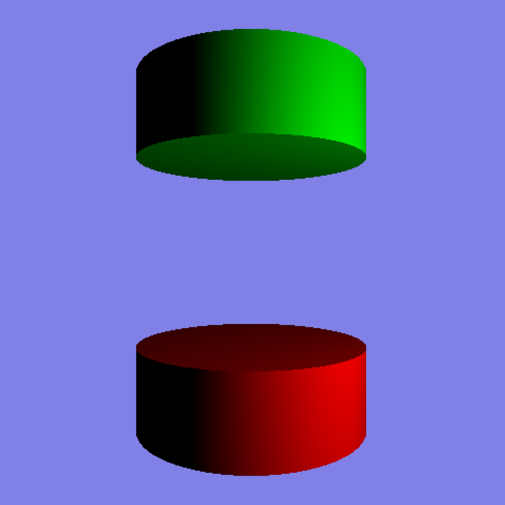
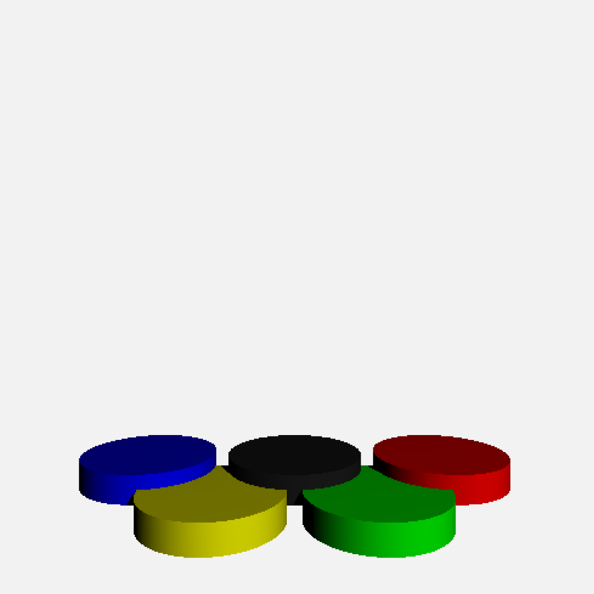
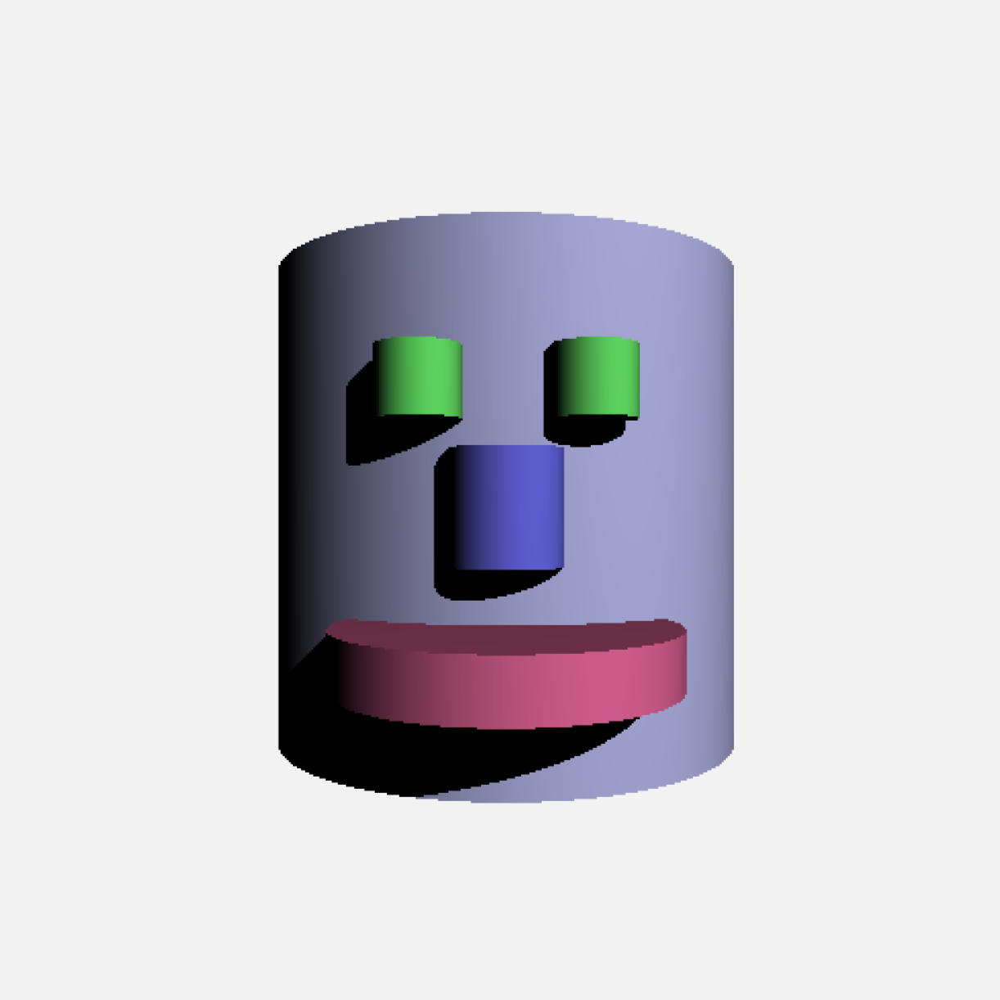
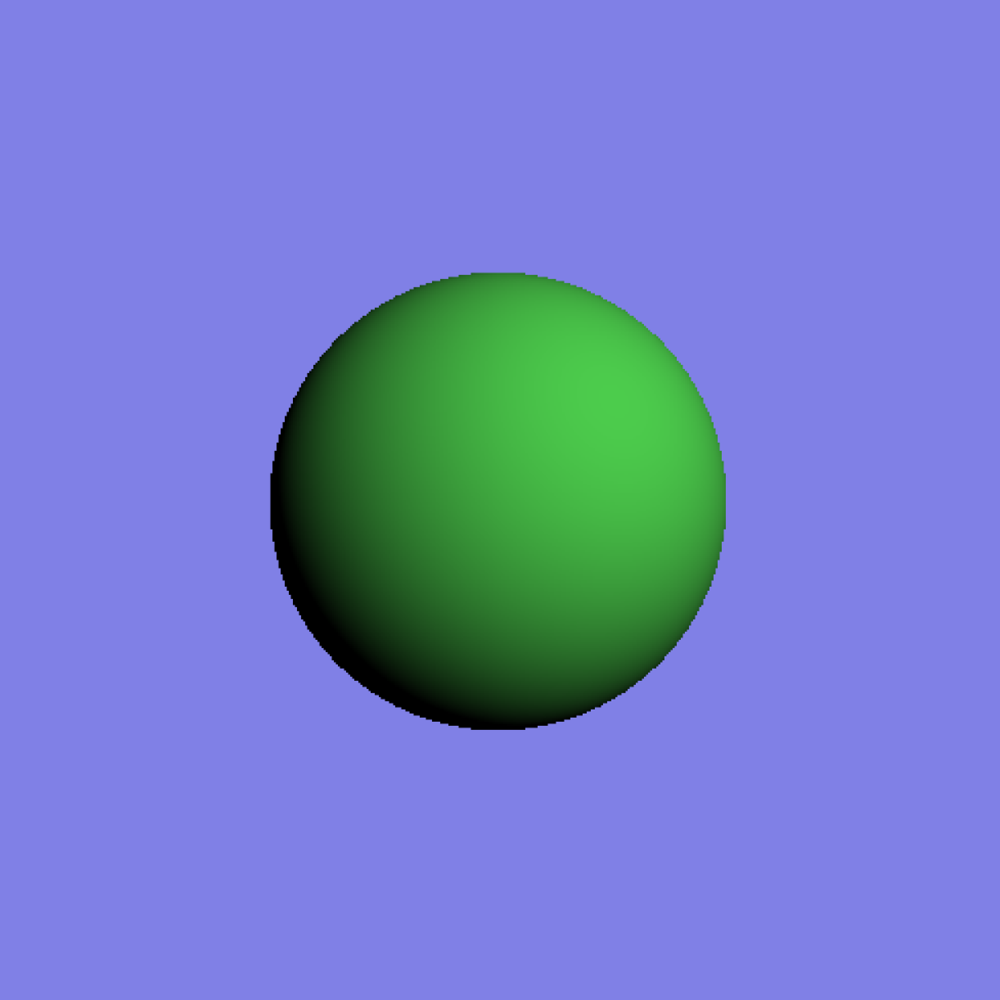
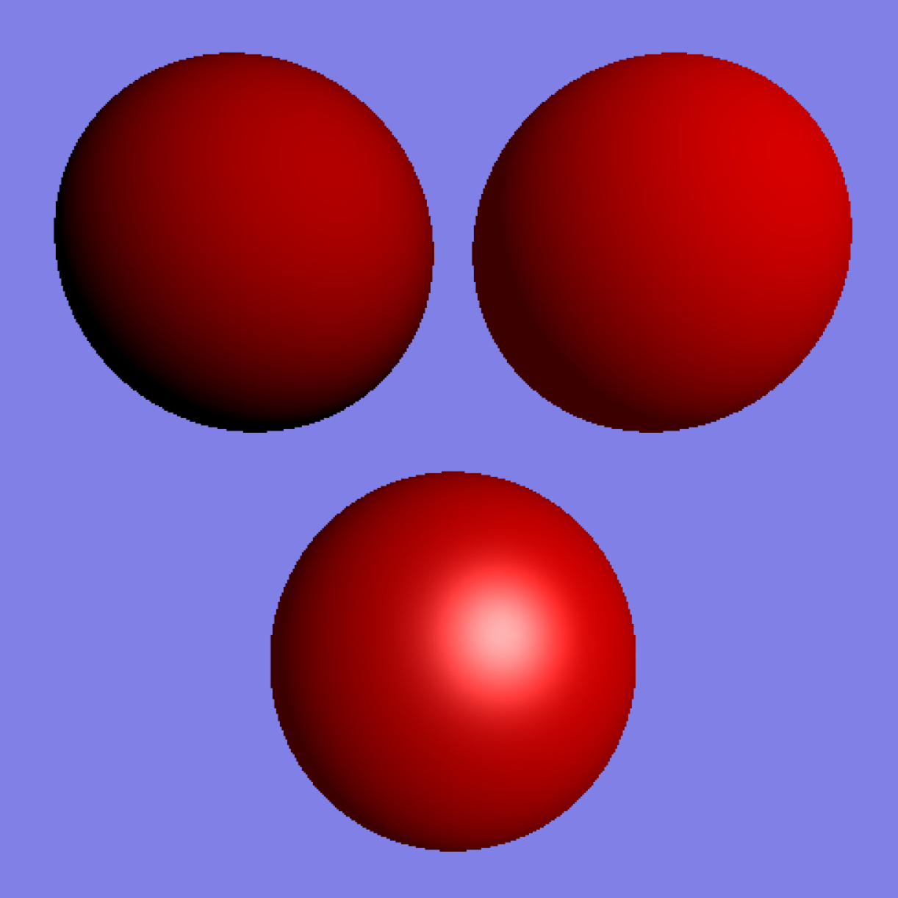
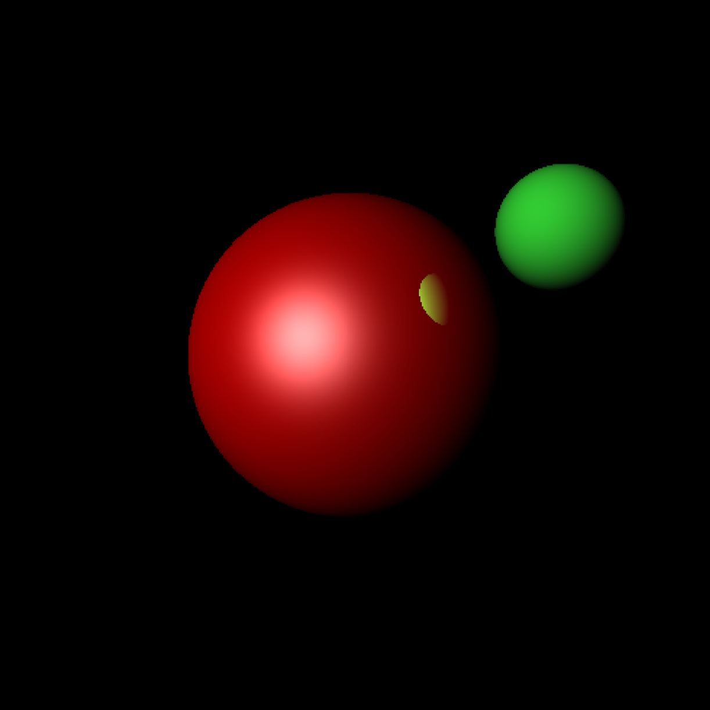
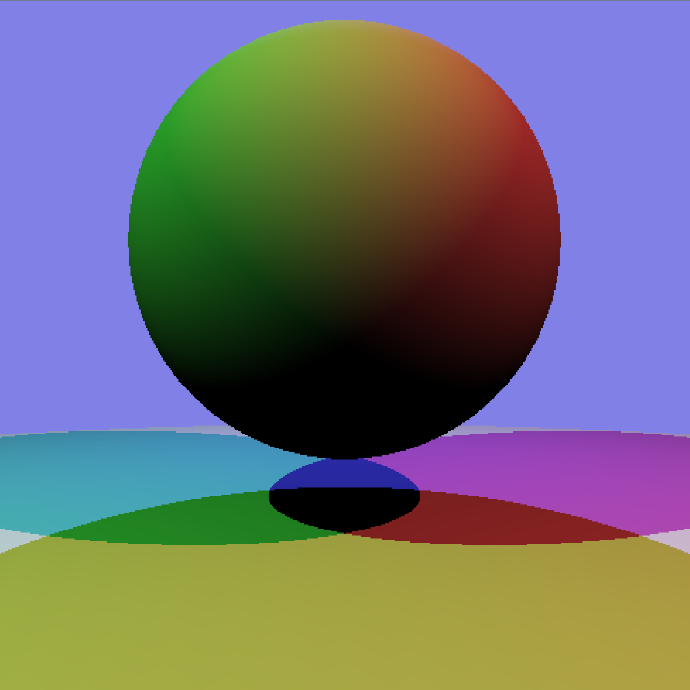
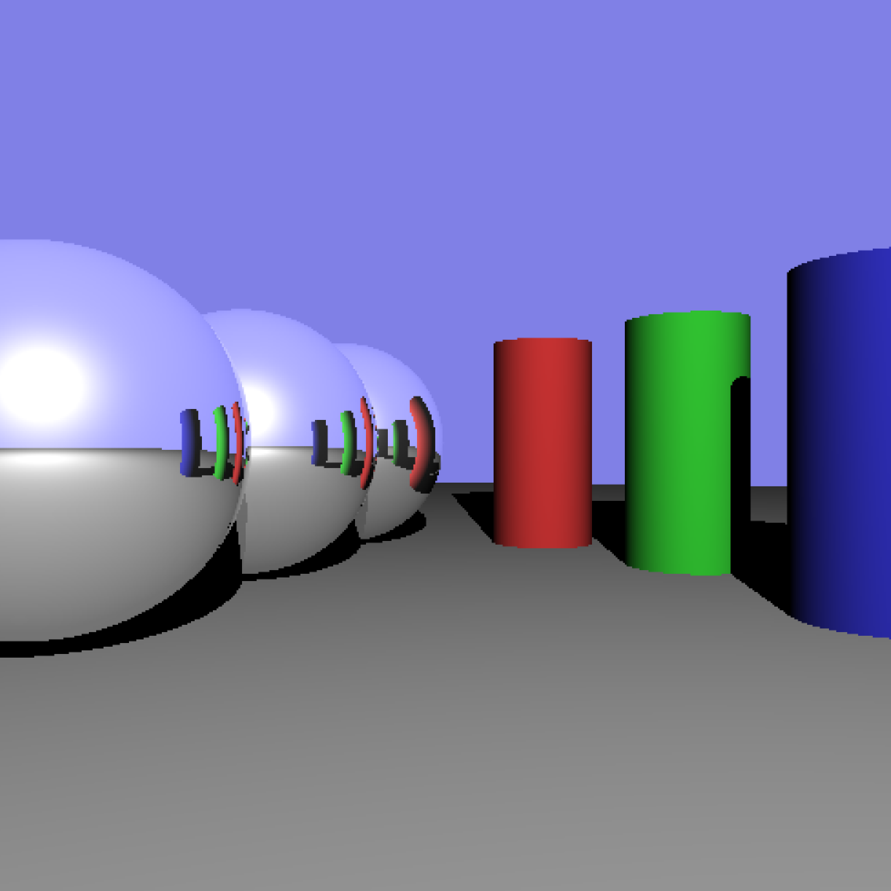

# RayTracing

### Project Description ###
Goals:
1. Initialize the scene
2. Cast eye rays for each pixel
3. Implement detection of ray intersection with cylinders
4. Implement the diffuse shading equation
5. Add end caps to your cylinders
6. Create sphere objects
7. Add ambient and specular terms for shading
8. Enable shadow creation by light sources
9. Allow the creation of surfaces that include reflections

### Images Created ###
Use keystrokes 1-8   
 
 
 
 
